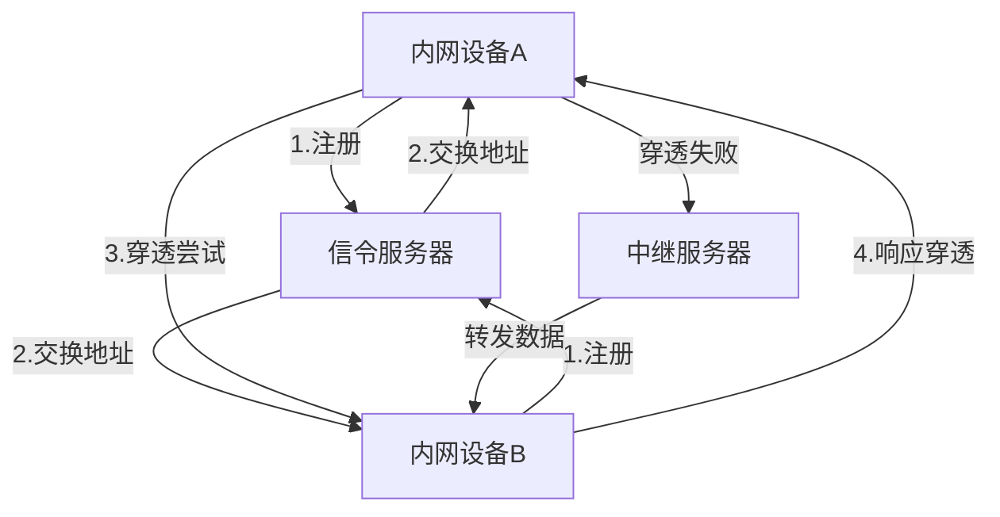
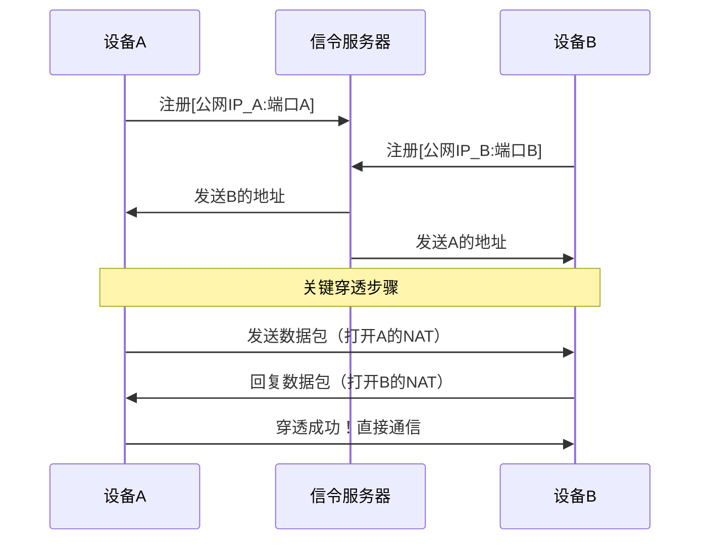
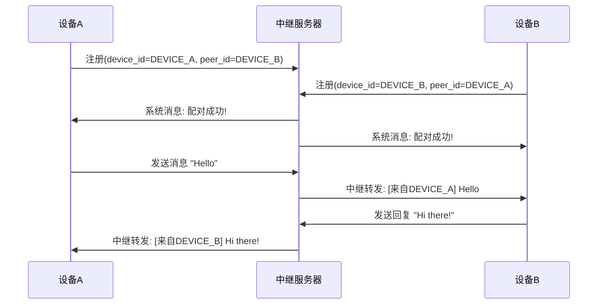

# 基于python3.12的极简NAT穿透通信Demo

## 架构概述

### 信令服务器工作原理

#### 20250713单机模拟穿透（无中继转发逻辑）
##### 操作步骤
    1、打开三个终端窗口；
    2、窗口1：运行服务器 python server.py
    3、窗口2：运行设备A python device.py
       输入ID：DEVICE_A
       服务器IP：127.0.0.1
    4、窗口3：运行设备B python device.py
       输入ID：DEVICE_B
       服务器IP：127.0.0.1
##### 预期结果
###### 设备A输出
    收到对端信息: DEVICE_B
    尝试连接 DEVICE_B:
      - 公网地址: 127.0.0.1:53902
      - 内网地址: 192.168.1.100:53902
    已向 ('127.0.0.1', 53902) 发送穿透包
    已向 ('192.168.1.100', 53902) 发送穿透包
    穿透成功！收到来自 ('127.0.0.1', 53902) 的消息: PUNCH from DEVICE_B
    
### 中继模式工作原理

