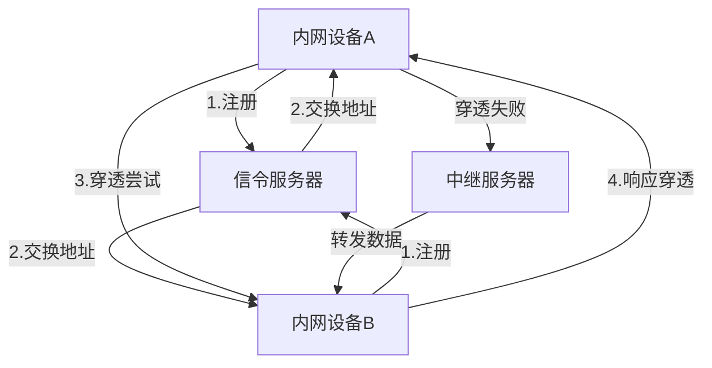
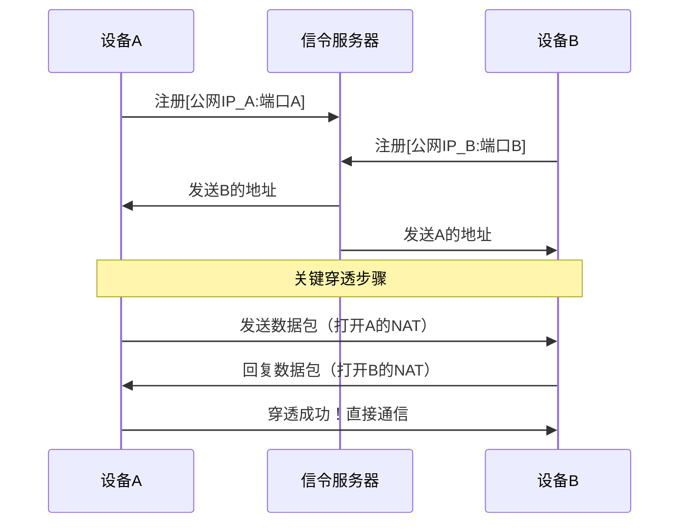
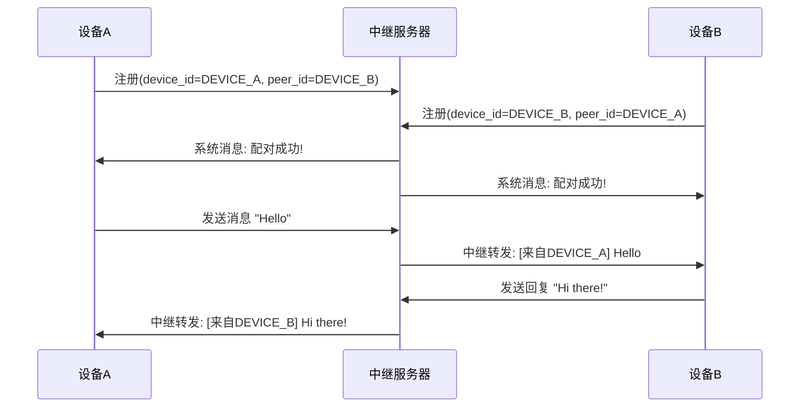

# 基于python3.12的极简NAT(UDP协议)穿透通信Demo

## 架构概述

### 信令服务器工作原理

#### 单机模拟穿透（无中继转发逻辑）(tag:20250713)
##### 操作步骤
    1、打开三个终端窗口；
    2、窗口1：运行服务器 python server.py
    3、窗口2：运行设备A python device.py
       输入ID：DEVICE_A
       服务器IP：127.0.0.1
    4、窗口3：运行设备B python device.py
       输入ID：DEVICE_B
       服务器IP：127.0.0.1
##### 预期结果
###### 设备A输出
    收到对端信息: DEVICE_B
    尝试连接 DEVICE_B:
      - 公网地址: 127.0.0.1:53902
      - 内网地址: 192.168.1.100:53902
    已向 ('127.0.0.1', 53902) 发送穿透包
    已向 ('192.168.1.100', 53902) 发送穿透包
    穿透成功！收到来自 ('127.0.0.1', 53902) 的消息: PUNCH from DEVICE_B

#### 真实环境（！！！暂未测试）
##### 操作步骤
    1、将server.py部署到云服务器（阿里云/腾讯云）
    2、在两个不同的局域网设备上：
       设备A python device.py
       输入设备ID: DEVICE_A  
       服务器IP: [你的云服务器IP]
       设备Bpython device.py
       输入设备ID: DEVICE_B  
       服务器IP: [你的云服务器IP] 
    3、观察穿透结果

### 中继模式工作原理

#### 单机模拟穿透（含中继模式）(tag:20250713)
##### 操作步骤
    1、启动服务：
      # 终端1: 信令服务器
        python server.py
      # 终端2: 中继服务器
        python relay_server.py
      # 终端3: 设备A
        python device.py
        输入设备ID: DEVICE_A
        信令服务器IP: 127.0.0.1
      # 终端4: 设备B
        python device.py
        输入设备ID: DEVICE_B
        信令服务器IP: 127.0.0.1
##### 预期结果
###### 信令服务器
    信令服务器启动，端口：9999
    设备注册：DEVICE_A :公网('127.0.0.1', 60767) 内网192.168.1.30:60767
    设备注册：DEVICE_B :公网('127.0.0.1', 55842) 内网192.168.1.30:55842
    已发送 DEVICE_A -> DEVICE_B 的地址
    已发送 DEVICE_B -> DEVICE_A 的地址
###### 中继服务器
    中继服务器启动在 0.0.0.0:10000
    设备配对: DEVICE_B <-> DEVICE_A
###### 设备A
    ...
    穿透成功！收到来自 ('127.0.0.1', 55842) 的消息：HELLO ('127.0.0.1', 60767)!
    穿透成功！收到来自 ('127.0.0.1', 55842) 的消息：HELLO ('127.0.0.1', 60767)!
    中继模式已启动，输入消息开始通信...  
    穿透成功！收到来自 ('127.0.0.1', 10000) 的消息：{"type": "system", "content": "\u7b49\u5f85\u5bf9\u7aef DEVICE_B \u8fde\u
    63a5\u4e2d\u7ee7..."}
    输入内容（输入‘exit’退出）
    穿透成功！收到来自 ('127.0.0.1', 10000) 的消息：{"type": "system", "content": "\u914d\u5bf9\u6210\u529f! \u4e0e DEVICE_B
    \u5efa\u7acb\u4e2d\u7ee7\u8fde\u63a5"}
    穿透成功！收到来自 ('127.0.0.1', 10000) 的消息：{"type": "system", "content": "\u65e0\u6548\u7684JSON\u683c\u5f0f"}
    ...    
    接收错误： timed out
###### 设备B
    结果与设备A 输出日志类似，此处不再展开演示

